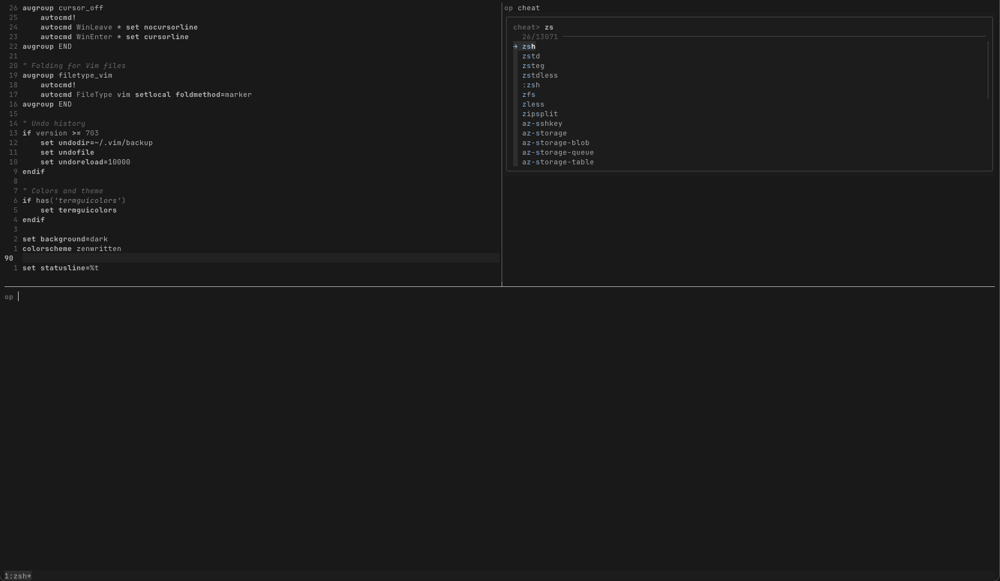

# dot

Minimal dotfiles for a quiet terminal.



This repository configures Zsh, Vim, Tmux and Ghostty (optional).

Shared configuration is separated from profile-specific settings.

## Structure

```
.
├── zsh/            # prompt, fzf, completions
├── vim/            # vimrc only, uses vim-plug
├── tmux/           # tmux.conf and theme
├── profiles/       # environment-specific overrides
├── install/        # install scripts
├── Makefile        # make zsh, make vim, etc.
```

Each profile (e.g. `docker`) defines its own `env.zsh`, `aliases.zsh`, and optionally `functions.zsh`.

See [profiles/README.md](profiles/) for details on how to create your own.

No frameworks.
Minimal plugins.
Only symlinks, variables, what is needed.

## Requirements

You’ll need: `zsh`, `vim`, `tmux`, `fzf`, `make`, `curl`, and `ripgrep`.

These are typically available via your system's package manager.

## Installation

Clone anywhere. Then:

```sh
make all
```

To use a custom profile:

```sh
echo myprofile > ~/.current_profile
```

If unset, the `default` profile is used.

Run `make help` to see all available targets.

## Notes

- Completions for tools like `kubectl`, `helm`, etc. are generated via `make completions`.
- `fzf` is expected to be installed and sourced from `$FZF_INSTALL_PATH`.
- Vim uses [vim-plug](https://github.com/junegunn/vim-plug). Run `:PlugInstall` on first launch to install:
  - [`tpope/vim-commentary`](https://github.com/tpope/vim-commentary): comment/uncomment
  - [`ap/vim-css-color`](https://github.com/ap/vim-css-color): CSS color previews
  - [`zenbones-theme/zenbones.nvim`](https://github.com/zenbones-theme/zenbones.nvim): colorscheme

---
When you walk, just walk. When you sit, just sit.
